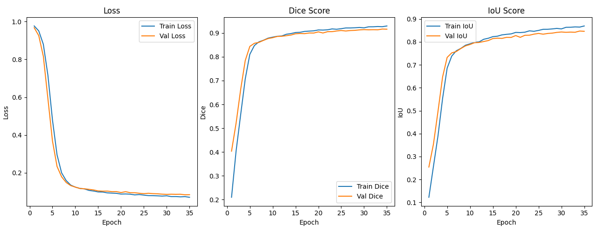

# Neurea

**Author**: Elio Ishak
**Last time modified**: 6/11/2026

Neurea is a PyTorch project for brain tumor segmentation using a U-Net model on the BraTS2020 dataset. It includes a custom dataset loader for HDF5 files, a train/validation split utility, Dice loss, Dice score and IoU metrics, model checkpointing, and training history visualization.


## Features

- U-Net architecture for 2D medical image segmentation
- BraTS HDF5 dataset loading with image normalization and binary mask conversion
- Volume-aware train/validation splitting to reduce data leakage
- Dice loss for segmentation training
- Dice score and IoU evaluation metrics
- Automatic best-model checkpoint saving based on validation Dice score
- Training curve visualization with Matplotlib

## Project Structure

```text
Neurea/
|-- .env                     # Path configuration
|-- .gitignore
|-- LICENSE                  # MIT License
|-- data/
|   |-- dataset.py           # BraTS HDF5 dataset loader
|   `-- split.py             # Volume-aware train/validation split
|-- losses/
|   `-- losses.py            # Dice loss
|-- metrics/
|   `-- metrics.py           # Dice score and IoU metrics
|-- models/
|   `-- unet.py              # U-Net model implementation
|-- results/
|   |-- history.csv          # Training history log
|   |-- MRI Scans.png        # Evaluation of the model (MRI SCANS)
|   |-- plot_history.py      # Plotting from saved CSV
|   `-- training_history.png # Saved training curves plot
|-- utils/
|   |-- load_model.py        # Model loading helper
|   |-- plot.py              # Training history plots
|   `-- train.py             # Training and validation loop
|-- main.py                  # Main training entry point
`-- requirements.txt         # Python dependencies
```

## Requirements

- Python 3.10+
- PyTorch
- h5py
- matplotlib
- tqdm
- pandas
- python-dotenv

Install dependencies:

```bash
pip install -r requirements.txt
```

## Configuration

Paths are configured in the `.env` file:

```env
DATA_PATH=./data/BraTS2020_training_data
SAVED_MODEL_PATH=./saved_models/best_model.pth
```

Edit `.env` to point to your local dataset and model checkpoint locations. Relative paths are resolved from the project root.

## Dataset

This project expects BraTS2020 training data stored as HDF5 files. Each file should contain:

- `image`: input MRI image array
- `mask`: segmentation mask array

The dataset loader expects images and masks in HDF5 format and converts them to PyTorch tensors with channel-first layout.

## Usage

Run the training script:

```bash
python main.py
```

The script will ask whether to:

- train a new model
- load an existing model checkpoint

During training, the model is optimized with Adam and Dice loss. The best checkpoint is saved to the project root and can be manually moved to `saved_models/`.

Training history is logged to `results/history.csv` at each epoch.

### Plotting from saved history

After training, you can regenerate the plots from the CSV without re-running:

```bash
python results/plot_history.py
```

This reads `results/history.csv` and displays the same loss / Dice / IoU curves.

## Model

Neurea uses a compact U-Net architecture with:

- 4 input channels
- 3 output channels
- encoder blocks with convolution, batch normalization, ReLU, and max pooling
- decoder blocks with transposed convolution and skip connections
- final 1x1 convolution for segmentation logits

## Metrics

Training and validation are tracked with:

- Dice loss
- Dice score
- Intersection over Union

Training curves are plotted after training using Matplotlib.



## Notes

- All paths are loaded from the `.env` file at runtime.
- GPU training is used automatically when CUDA is available.
- The train/validation split groups files by volume ID to avoid placing slices from the same volume in both sets.

## License

This project is licensed under the MIT License — see [LICENSE](LICENSE) for details.
